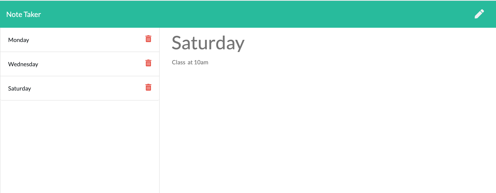

# Express Homework: Note Taker

## Description

THis is an application that can be used to write, save, and delete notes. This application will use an express backend and save and retrieve note data from a JSON file.

The URL of the deployed application: https://shielded-citadel-98819.herokuapp.com/

## Screenshot
  

## User Story

AS A user, I want to be able to write and save notes

I WANT to be able to delete notes I've written before

SO THAT I can organize my thoughts and keep track of tasks I need to complete

## License
[MIT](https://choosealicense.com/licenses/mit/)